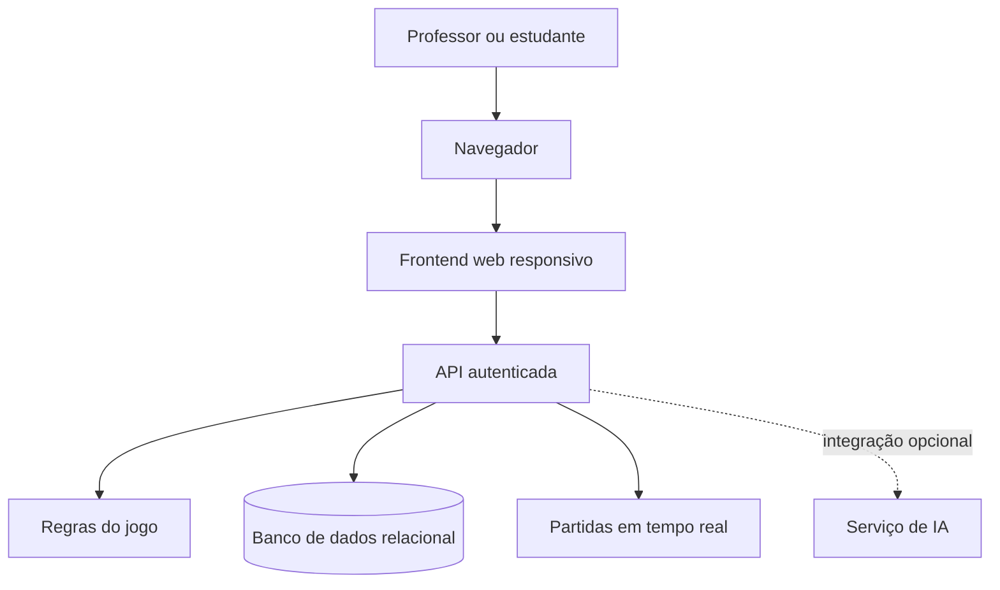

# TaskFlow Card

Plataforma web educacional gamificada que combina um jogo de cartas com perguntas e respostas elaboradas por professores.

> **Status:** em desenvolvimento. A documentação atual apresenta a proposta, a arquitetura, os requisitos e o plano de testes; a versão web funcional ainda não foi concluída.

## Sobre o projeto

O TaskFlow Card transforma momentos de uma partida de cartas em oportunidades de praticar conteúdos acadêmicos. Professores poderão organizar turmas e cadastrar questões, enquanto estudantes participarão de partidas pelo navegador, contra jogadores automatizados ou outros participantes.

A proposta usa a competição como apoio à aprendizagem, sem substituir o acompanhamento e as avaliações realizadas pelo professor.

O projeto foi desenvolvido como trabalho de conclusão do Bacharelado em Sistemas de Informação da Universidade de Mogi das Cruzes (UMC), com previsão de conclusão em 2026.

## Objetivos

O objetivo geral é desenvolver uma plataforma web educacional gamificada que permita:

- aos professores gerenciar turmas, estudantes, perguntas e respostas;
- aos estudantes praticar conteúdos em partidas interativas;
- executar e validar as regras do jogo no servidor;
- oferecer partidas contra jogadores automatizados e, quando tecnicamente viável, partidas on-line;
- registrar resultados, participação e estatísticas vinculadas às turmas;
- avaliar a solução por meio de testes funcionais, de usabilidade, acessibilidade, integração e segurança.

## Como funciona o jogo

1. O estudante acessa a plataforma e entra em uma turma ou partida autorizada.
2. Cada jogador começa com sete cartas.
3. Os participantes jogam em turnos sucessivos.
4. Ao jogar a carta, o participante deve responder a uma questão cadastrada pelo professor.
5. Em caso de acerto, descarta uma carta adicional; em caso de erro, compra duas cartas.
6. A mão, o turno e o placar são atualizados.
7. Vence quem ficar sem cartas primeiro.

Casos como empate, desconexão, reconexão, ausência de perguntas e limite de tempo ainda precisam ser definidos durante a implementação.

## Perfis de usuário

### Professor

- criar e administrar turmas;
- cadastrar e revisar perguntas, alternativas e explicações;
- vincular questões a conteúdos ou níveis de dificuldade;
- gerenciar participantes;
- consultar desempenho, ranking e estatísticas;
- revisar qualquer conteúdo sugerido por inteligência artificial antes de publicá-lo.

### Estudante

- acessar a plataforma com uma conta autorizada;
- entrar em turmas e partidas;
- jogar cartas e responder às questões apresentadas;
- treinar contra jogadores automatizados;
- participar de partidas on-line quando o modo multijogador estiver disponível;
- consultar resultados e ranking permitidos.

## Arquitetura proposta

A solução segue uma arquitetura cliente-servidor:

- o **frontend** apresenta a interface e envia as ações do usuário;
- o **backend** concentra autenticação, autorização, regras da partida, validação das jogadas e acesso aos dados;
- o **servidor** mantém autoridade sobre turnos, cartas, respostas e condições de vitória;
- o **banco de dados relacional** armazena usuários, turmas, questões, partidas e estatísticas;
- a **sincronização em tempo real** será usada no modo multijogador;
- a **integração com IA** é opcional e deve ocorrer somente no backend.

### Componentes e tecnologias documentados

- frontend compatível com navegadores modernos, usando HTML, CSS e JavaScript;
- servidor HTTP com rotas REST autenticadas;
- banco de dados MySQL;
- sessões protegidas e controles contra CSRF;
- hash de senhas com PBKDF2;
- proteção de dados sensíveis com AES-256-GCM;
- gerenciamento de chaves com RSA-3072 e proteção fornecida pelo ambiente do servidor;
- API Gemini opcional para apoiar a sugestão de questões.

O framework do backend, a infraestrutura de hospedagem e a tecnologia de comunicação em tempo real ainda não estão definidos na documentação.

## Modelo de dados

O modelo apresentado no projeto contempla, entre outros, os seguintes grupos de dados:

- usuários, perfis, credenciais e bloqueios de acesso;
- relação entre responsáveis pelo cadastro e contas cadastradas;
- turmas e participações;
- perguntas, alternativas, respostas e explicações;
- partidas, rodadas, mãos, jogadas e resultados;
- estatísticas de desempenho;
- chaves criptográficas;
- registros de auditoria.

Dados pessoais, perguntas e explicações sensíveis devem ser armazenados de forma protegida. Consultas parametrizadas e restrições de integridade devem reduzir inconsistências e riscos de injeção.

## Requisitos funcionais

- **RF01:** autenticar professores e estudantes;
- **RF02:** permitir ao professor gerenciar turmas, participantes, perguntas e respostas;
- **RF03:** permitir ao estudante ingressar somente em turmas e partidas autorizadas;
- **RF04:** distribuir sete cartas e controlar os turnos;
- **RF05:** oferecer partidas contra jogadores automatizados e outros jogadores;
- **RF06:** sincronizar partidas on-line quando o modo multijogador estiver habilitado;
- **RF07:** registrar resultados e estatísticas vinculados à turma.

## Requisitos não funcionais

- **RNF01:** funcionar em navegadores atuais e em diferentes tamanhos de tela;
- **RNF02:** utilizar HTTPS e autenticação protegida;
- **RNF03:** validar regras e permissões no servidor;
- **RNF04:** não expor credenciais, respostas corretas ou cartas dos adversários;
- **RNF05:** observar a LGPD e as recomendações de acessibilidade do eMAG;
- **RNF06:** manter registros de erros e evidências de teste suficientes para manutenção e auditoria.

## Segurança e privacidade

A aplicação deve adotar, no mínimo:

- senhas armazenadas somente como hashes adequados;
- sessões ou tokens com validade limitada;
- autorização baseada no perfil do usuário;
- HTTPS e proteção contra falsificação de requisições;
- limitação de tentativas de autenticação;
- validação, pelo servidor, de toda ação recebida;
- ocultação das respostas corretas e das mãos adversárias até o momento autorizado;
- proteção das chaves de serviços externos e proibição de credenciais no frontend ou no repositório;
- coleta apenas dos dados pessoais necessários;
- registros de auditoria para eventos relevantes;
- tratamento de dados alinhado aos princípios de finalidade, necessidade, segurança e transparência da LGPD.

## Acessibilidade

As interfaces devem considerar desde o início:

- navegação por teclado;
- contraste adequado;
- indicação visível de foco;
- mensagens de estado compreensíveis;
- legibilidade das cartas e perguntas;
- adaptação a computadores, tablets e celulares;
- recomendações brasileiras de acessibilidade digital do eMAG.

## Plano de testes

O plano previsto abrange:

- cadastro, autenticação e permissões dos perfis;
- gerenciamento de turmas e questões;
- distribuição de cartas, turnos, desafio da quarta carta e vitória;
- partidas contra jogadores automatizados;
- sincronização entre navegadores;
- entradas inválidas e tentativas de acesso não autorizado;
- exposição indevida de respostas, cartas ou dados pessoais;
- usabilidade, acessibilidade, integração e segurança.

Cada caso de teste deverá registrar requisito, preparação, ação, resultado esperado, resultado obtido e evidência. Resultados empíricos só devem ser publicados depois da execução documentada dos testes.

## Autores

- Jonathas Eduardo Santo Ramos
- José Armando Abrão Boer

**Orientador:** Prof. Pedro Henrique Miho de Souza  
**Coorientador:** Prof. Alessandro Aparecido da Silva Hora  
**Instituição:** Universidade de Mogi das Cruzes — Bacharelado em Sistemas de Informação

## Referências principais

- [Lei Geral de Proteção de Dados Pessoais — LGPD](https://www.planalto.gov.br/ccivil_03/_ato2015-2018/2018/lei/l13709compilado.htm)
- [eMAG — Modelo de Acessibilidade em Governo Eletrônico](https://www.gov.br/governodigital/pt-br/acessibilidade-e-usuario/acessibilidade-digital/eMAGv31.pdf)
- [Cartilha de Segurança para Internet — CERT.br](https://cartilha.cert.br/livro/cartilha-seguranca-internet.pdf)
- [Base Nacional Comum Curricular — BNCC](https://basenacionalcomum.mec.gov.br/images/BNCC_EI_EF_110518_versaofinal_site.pdf)
- [HTML Living Standard — WHATWG](https://html.spec.whatwg.org/)
- [ECMAScript Language Specification — ECMA-262](https://tc39.es/ecma262/)
- [Gemini API](https://ai.google.dev/api)
